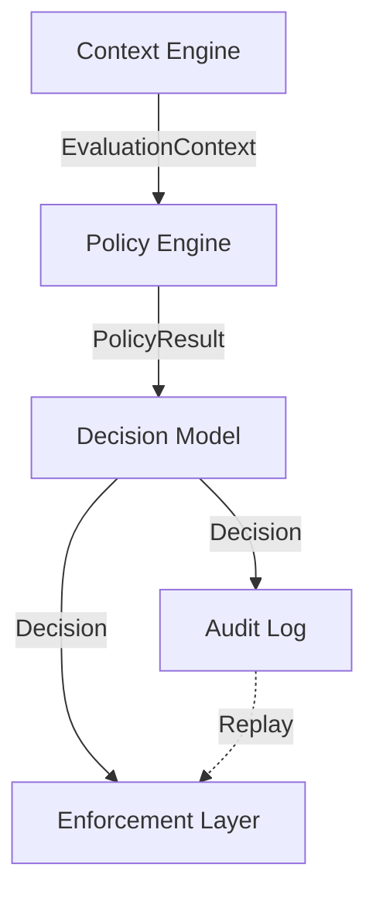

# ReleaseGate Architecture

## Overview
ReleaseGate uses a decoupled, 4-step pipeline to ensure deterministic and auditable governance.

## Key Concepts

### Deterministic Evaluation
- Same context + same policies → same decision
- No hidden state
- No probabilistic behavior

### Decision Hash
Decisions are integrity-protected using SHA-256 hashing of the canonical JSON representation. This ensures that the audit log provides a verifiable history of governance actions.

### Idempotency Keys
Every enforcement action (GitHub Check, Jira Comment) is generated with a deterministic `idempotency_key` based on the Decision ID, Action Type, and Target. This prevents duplicate actions and allows safe retries in CI/CD pipelines.

### Retroactive Enforcement
Because `EnforcementTargets` are stored within the immutable `Decision` object, actions can be executed (or re-executed) at any time after the initial evaluation. This enables delayed governance and robust handling of external API failures.
