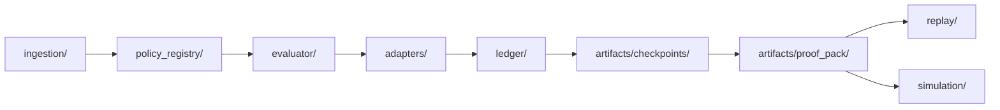

# ReleaseGate Architecture



## Module Boundary Map

| Architecture Node | Target Module Boundary | Current Implementation Mapping |
|---|---|---|
| Ingestion | `releasegate/ingestion/` | `releasegate/integrations/jira/`, provider modules |
| Policy Registry | `releasegate/policy_registry/` | `releasegate/policy/loader.py`, `releasegate/saas/policy.py` |
| Evaluator | `releasegate/evaluator/` | `releasegate/engine.py`, `releasegate/engine_core/` |
| Enforcement Adapters | `releasegate/adapters/` | `releasegate/integrations/jira/workflow_gate.py`, enforcement runner |
| Ledger | `releasegate/ledger/` | `releasegate/audit/overrides.py`, `releasegate/audit/recorder.py` |
| Checkpoints | `releasegate/artifacts/checkpoints/` | `releasegate/audit/checkpoints.py` |
| Proof Packs | `releasegate/artifacts/proof_pack/` | `releasegate/server.py` proof-pack endpoint, CLI proof-pack command |
| Replay | `releasegate/replay/` | `releasegate/replay/decision_replay.py` |
| Simulation | `releasegate/simulation/` | `releasegate/policy/simulation.py` |

## Boundary Rules

- Evaluator is pure decision logic (no external side effects).
- Adapters enforce decisions and own API/protocol translation.
- Ledger and artifact generation are append-only / read-only workflows.
- Replay and simulation operate from stored snapshots and policy bindings.

---

## Decision Semantics Source of Truth

Decision output fields, `reason_code` meanings, and strict/permissive behavior are defined only in `docs/decision-model.md`.
Other docs (including this architecture reference) are descriptive and defer to that spec.
Forge runtime hardening and failure handling is documented in `docs/forge-hardening.md`.

---

---

## Core Architecture

ReleaseGate is built on four enforcement pillars.

### Pillar 1: Transition-Level Enforcement (Hard ALLOW / DENY)

#### What it guarantees

No Jira transition, PR merge, or release decision proceeds unless ReleaseGate explicitly returns `ALLOW` or `DENY`.
There is no advisory mode in production enforcement.

#### Authoritative gate

All enforcement flows through a single deterministic gate:

```text
check_transition(issue_key, transition_id, actor, context) -> ALLOW | DENY
```

This function:

- Evaluates the resolved policy bundle
- Binds the decision to an immutable snapshot
- Produces `decision_hash`, `input_hash`, `policy_hash`, and `replay_hash`
- Emits an auditable decision record

#### Deterministic and idempotent

**Same PR + same commit + same policy + same engine version → same `decision_id`. Every time. Across re-runs, across event types, across the merge boundary.** This is the deterministic-governance milestone shipped in v2.2.0 (PR #128).

The `decision_id` is a `sha256` over **only verdict-bearing inputs**:

| Field | What it is |
|---|---|
| `tenant_id`, `repo`, `pr_number`, `commit_sha` | Identity of the change being decided about |
| `policy_bundle_hash` | The exact policy material that evaluated this change |
| `decision`, `reason_codes`, `risk_score` | The verdict itself |
| `signals.metrics`, `signals.dependency_provenance`, `signals.override_flags` | The evidence the verdict is based on |

Anything else — `workflow_run.run_id`, `workflow_run.run_attempt`, `workflow_run.ref`, `workflow_run.sha`, `source_ref`, `issued_at`, GitHub event metadata — is **run-of-record**. It does **not** influence `decision_id`. It still rides in `bundle.signals` → DSSE attestation, so forensic queries ("which CI run signed this verdict?") work, but it cannot drift the verdict hash.

This is enforced by an **allowlist** in `releasegate/attestation/service.py` (`_VERDICT_BEARING_SIGNAL_KEYS`) plus a **contract test** that fails CI if a contributor adds a new `signals_payload` key without explicitly classifying it as either verdict-bearing or run-of-record. The next env-var leak is impossible by construction, not by vigilance.

#### Storage idempotency follows from determinism

Because `change_id = sha1(tenant|decision_id)[:16]` is deterministic, **re-runs do not grow the `change_records` row count**. The same logical change collapses on the unique-constraint handler.

| Table | Behaviour on re-run of the same PR |
|---|---|
| `audit_decisions` | Multiple rows possible (one per signed envelope), all sharing the same `decision_id` |
| `cross_system_correlations` | Single row (`correlation_id` deterministic; UPDATE path tops up `rg_decision_ids`) |
| `change_records` | Single row (`change_id` deterministic; INSERT collides, swallowed by unique constraint) |

#### Per-run cryptographic audit trail (forensics preserved)

Each CI invocation still produces its own:

- **DSSE-signed envelope** — its own `signed_payload_hash`, `attestation_id`, and Ed25519 signature bytes (`releasegate.dsse.json`).  Each CI invocation produces its own immutable row in `audit_attestations` keyed on `(tenant_id, attestation_id)` — many rows per logical decision, one per signing event.  Re-recording the same DSSE artifact is idempotent (PRIMARY KEY collision swallowed by `ON CONFLICT DO NOTHING`).
- **Per-run `bundle.timestamp`** capturing the exact issuance moment
- **Run-of-record metadata** (`workflow_run.run_id`, `run_attempt`, `ref`, `sha`, `actor`, `source_ref`) preserved verbatim in `bundle.signals` and the DSSE envelope
- **Per-run `deploy_id`** in `change_records` and `cross_system_correlations` (`gha_<RUN_ID>_a<ATTEMPT>`)

> **Tagline:** *Deterministic governance with per-run cryptographic audit trails.*

In other words: the **verdict** is reproducible; every **execution** still gets its own signed envelope. That's exactly what compliance auditors need — a stable judgement plus a per-run forensic chain.

ReleaseGate stores, in addition to `decision_id`:

- `evaluation_key`
- `input_snapshot`
- `policy_bundle_hash`
- `attestation_id` (per-run unique — `audit_attestations` accumulates one immutable row per signing event, all sharing the same `decision_id` for re-runs of the same logical decision)
- `signed_payload_hash` (per-run unique — derived from the canonicalized DSSE payload; equal to `attestation_id` by construction)
- `replay_hash`

Together these guarantee replayability, forensic traceability, and **no nondeterministic drift**.

#### Risk-aware enforcement

Signals include:

- GitHub PR risk score
- Churn metrics
- Severity level
- Dependency provenance
- Privileged path detection
- Transition metadata
- Actor role

Policies evaluate these signals declaratively.

#### Phase 1 operational controls

- Override TTL boundary rule: override is active while `evaluation_time <= expires_at`.
- Separation of duties:
  - Override requester cannot approve the same override.
  - PR author cannot approve override.
  - Actor identities are normalized (case-insensitive) and can be mapped through alias sets.
- Strict fail-closed behavior:
  - Controlled by `RELEASEGATE_STRICT_FAIL_CLOSED` (global) and `policy_overrides.strict_fail_closed` (request-level).
  - In strict mode, missing policy/risk/signals or dependency timeout/error resolves to `BLOCKED`.
- Idempotency contract for deploy and incident gates:
  - Header: `Idempotency-Key` (recommended; server derives one if omitted).
  - Same key + same payload: returns the same stored response.
  - Same key + different payload: returns `409 Conflict`.

---

### Pillar 2: Declarative Policy Engine and Immutable Rollout

#### Declarative policy DSL

Policies are defined in YAML:

```yaml
version: 1
policies:
  - id: high_risk_release
    when:
      risk: HIGH
      environment: production
    require:
      approvals: 2
      roles: [EngineeringManager, Security]
```

Policies are versioned, schema validated, compiled, and hashed.

#### Snapshot binding (immutable)

Every decision stores:

- `snapshot_id`
- Full resolved policy snapshot
- `policy_hash`
- `policy_resolution_hash`
- `compiler_version`
- `resolution_inputs`

Snapshots are immutable, hash-verifiable, and bound to each decision.

Approval freshness windows:

- `approval_requirements.max_age_seconds`
- `approvals.max_age_seconds`

Verification endpoint:

```text
GET /decisions/{decision_id}/policy-snapshot/verify
```

#### Staged policy rollout (Dev → Staging → Prod)

Policies are deployed like software:

- Active in dev
- Promoted to staging
- Scheduled for prod
- Activated via scheduler
- Rolled back via pointer switch

Endpoints:

- `POST /policy/releases`
- `POST /policy/releases/promote`
- `POST /policy/releases/scheduler/run`
- `POST /policy/releases/rollback`
- `GET /policy/releases/active`

#### Advanced lint gate

ReleaseGate includes a pre-rollout linter that detects:

- `CONTRADICTORY_RULES`
- `AMBIGUOUS_OVERLAP`
- `COVERAGE_GAP`
- `RULE_UNREACHABLE_SHADOWED` (warning)

Lint runs before activation and blocking issues prevent rollout.

#### CI gate

Pre-merge policy validation:

```text
POST /policies/ci/validate
```

Returns structured `PASS` / `FAIL` verdict with lint details, conflict analysis, and simulation summary. Suitable for blocking CI pipelines before policy changes land.

---

### Pillar 3: Audit Evidence and Cross-System Integrity

#### Deterministic replay

Every decision stores canonicalized inputs, context, and compiled policy snapshot.

Replay endpoint:

```text
POST /decisions/{id}/replay
```

Replay guarantees:

- Uses stored policy snapshot (not current policy)
- Returns structured `deterministic` block and `meta` block
- Emits structured diff on mismatch
- Persists immutable replay event

#### Formal evidence graph

Every decision produces a structured evidence graph.

Node types: `DECISION`, `POLICY`, `SIGNAL`, `ARTIFACT`, `OVERRIDE`, `DEPLOYMENT`, `INCIDENT`, `REPLAY`

Edge types: `USED_POLICY`, `USED_SIGNAL`, `PRODUCED_ARTIFACT`, `OVERRIDDEN_BY`, `AUTHORIZED_BY`, `RESOLVED_BY`

Graph APIs:

```text
GET /decisions/{id}/evidence-graph
GET /decisions/{id}/explain
```

#### Cross-system correlation enforcement

Deploy gate:

```text
POST /gate/deploy/check
```

Default hard-deny conditions: `CORRELATION_ID_MISSING`, no approved decision, repo mismatch, commit mismatch, artifact digest mismatch, environment policy violation.

Incident close gate:

```text
POST /gate/incident/close-check
```

Incident closure requires valid deploy linkage.

#### Atomic and append-only persistence

Decision recording is fully atomic — decision, policy snapshot, evidence graph, artifacts, and references are written in a single database transaction. If any write fails, the entire operation rolls back.

Append-only enforcement via database triggers on `audit_decision_replays`, `evidence_nodes`, and `evidence_edges`.

---

### Pillar 4: Trust & Audit Fabric

Pillar 4 makes system integrity **provable rather than claimed**. Every guarantee is independently verifiable by an auditor without access to the running system.

#### Trust score

A 0–100 composite score updated in real time from six weighted components:

| Component | Weight | Criteria |
| --- | --- | --- |
| Ledger Integrity | 25 | All override hash chains valid |
| Checkpoint Freshness | 20 | Latest checkpoint within 36 hours |
| Checkpoint Signed | 15 | Latest checkpoint has Ed25519 signature |
| Signal Freshness | 15 | Zero-trust mode active — stale signals rejected |
| Key Integrity | 15 | No signing keys compromised |
| External Anchoring | 10 | At least one checkpoint anchored externally |

Accessible at: `GET /audit/trust-status`

#### Signed daily checkpoints

A checkpoint is published for each UTC day that has activity:

- `root_hash`: Merkle root of all transparency log entries for the period
- `prev_checkpoint_hash`: links to prior checkpoint, forming a hash chain
- `signature`: Ed25519 signature from the tenant or root signing key

Endpoints:

```text
POST /anchors/checkpoints/daily/{date_utc}/publish
GET  /anchors/checkpoints/daily/{date_utc}/verify
```

#### External anchoring (RFC 3161)

Checkpoint root hashes are submitted to an external timestamp authority (TSA). The returned RFC 3161 token proves the hash existed at a specific time — independently of ReleaseGate. Tampering with history requires forging a TSA token from a trusted CA.

#### Zero-trust signal freshness

Signals older than `max_age_seconds` are rejected at evaluation time. Each decision in the evidence graph carries a `signal_freshness` field with `stale`, `age_seconds`, `reason_code`, and `computed_at`.

Config: `RELEASEGATE_SIGNAL_MAX_AGE_SECONDS`, `RELEASEGATE_FAIL_ON_STALE`

#### Proof-of-history export (SOC2 v1)

Export a portable, independently verifiable audit bundle:

```text
GET /audit/export?repo=<repo>&contract=soc2_v1
```

The bundle includes decision records, input/policy/replay hashes, override chain with verification status, and integrity aggregates — all verifiable offline.

Per-decision proof packs (ZIP with DSSE attestation, inclusion proof, RFC 3161 token):

```text
GET /audit/proof-pack/{decision_id}
```

Offline verification:

```bash
python -m releasegate.cli verify-pack proofpack.zip \
  --format json \
  --key-file public-keys.json
```

#### Merkle tree inclusion proofs

Every transparency log entry has an inclusion proof: a set of sibling hashes that, combined with the leaf hash, reproduce the published Merkle root. An auditor can verify any individual record without downloading the full log.

See: [Transparency Merkle Rules](docs/transparency_merkle.md)

#### Tamper evidence

Ten database tables are append-only, protected by triggers that prevent UPDATE and DELETE on both SQLite and PostgreSQL. Any mutation raises an exception and is logged as a security event.

See: [Tamper-Evidence Architecture](docs/security/tamper-evidence.md)

---

### Combined effect

| Pillar | Capability |
| --- | --- |
| Pillar 1 | Hard real-time enforcement gate |
| Pillar 2 | Immutable, versioned, staged policy governance |
| Pillar 3 | Deterministic replay, evidence graph, cross-system integrity |
| Pillar 4 | Cryptographic proof of system integrity — independently verifiable |

Together, ReleaseGate is a verifiable change authorization system that can survive procurement and audit review.

---


---

## Core Capabilities

### 1. Transition-Level Hard Enforcement

- Deterministic `ALLOW` / `BLOCK` / `SKIPPED` decisions
- Strict fail-closed mode (configurable)
- Idempotent transition handling
- Concurrency-safe override processing
- Runs inside Atlassian Forge trust boundary

**Environment flags:**

```bash
RELEASEGATE_STRICT_MODE=true
RELEASEGATE_LEDGER_VERIFY_ON_STARTUP=true
RELEASEGATE_LEDGER_FAIL_ON_CORRUPTION=true
```

### 2. Declarative Policy Control Plane

- YAML / JSON DSL with explicit version field
- Strict schema validation (`extra="forbid"`)
- Policy lint + CI enforcement
- Policy scoping (org / project / workflow / transition scope hierarchy)
- Inheritance resolution with provenance tracking
- Conflict and shadowing detection
- Policy simulation ("what-if" mode)
- Pre-merge CI gate

Each decision stores `policy_id`, `policy_version`, `policy_hash`, full policy snapshot, and full input snapshot. **Policies are treated as immutable artifacts.**

### 3. Separation of Duties Enforcement

- PR author cannot self-approve
- Override requestor cannot self-approve
- Role-based approval validation
- Time-bound overrides with required justification
- Automatic override expiry enforcement (`OVERRIDE_EXPIRED`)
- Override freshness revalidation (`OVERRIDE_STALE`)

### 4. Immutable Audit Ledger

- Append-only storage with database trigger protection
- Hash-chained entries
- Ledger verification API
- Startup integrity verification

### 5. Cryptographic Checkpointing

- Signed root checkpoints (daily)
- Ed25519 signatures
- RFC 3161 external timestamp anchoring
- Stored separately from primary ledger
- Verification API and CLI

### 6. Audit Proof Pack (Evidence Bundle)

Export a portable proof bundle containing:

- `decision_snapshot`, `policy_snapshot`, `input_snapshot`
- `override_snapshot` (if applicable)
- `chain_proof`, `checkpoint_proof`
- `evidence_graph`
- Integrity hashes and `schema_version`

**Independent verification requires only the proof pack and public key — no ReleaseGate access needed.**

### 7. Deterministic Replay

Replay any historical decision using stored policy and input snapshots. Verifies outcome consistency, policy binding integrity, and snapshot correctness.

### 8. Policy Simulation ("What-If" Mode)

Simulate new policies against historical decisions. Metrics include `would_newly_block`, `would_unblock`, `delta`, and impact breakdown.

### 9. Minimal Metadata-Only GitHub Integration

ReleaseGate does **not** clone repositories, store diffs, store source code, or persist access tokens. It consumes PR metadata only (`changed_files`, `additions`, `deletions`). **Security posture is intentionally minimal.**

---


---

## Trust Guarantees

- Signed attestations are deterministic (`Ed25519`) and verifiable offline.
- Public signing keys are published via root-signed manifests:
  - `/.well-known/releasegate-keys.json`
  - `/.well-known/releasegate-keys.sig`
- Key status semantics are explicit (`ACTIVE`, `DEPRECATED`, `REVOKED`).
- Transparency log records every attestation issuance in append-only storage.
- Merkle anchoring rules: [docs/transparency_merkle.md](docs/transparency_merkle.md)
- Signed daily external roots are published to `roots/YYYY-MM-DD.json` via GitHub Actions.
- DSSE + in-toto export for supply-chain interoperability:
  - CLI: `releasegate analyze-pr --repo ORG/REPO --pr 15 --tenant default --emit-dsse att.dsse.json`
  - API: `GET /attestations/{attestation_id}.dsse`
  - Verify: `releasegate verify-dsse --dsse att.dsse.json --key-file public.pem --require-keyid <keyid>`

---


---

## Architecture Overview

```
GitHub PR → Risk Metadata (counters only)
            ↓
Jira Issue Property (releasegate_risk)
            ↓
Forge Workflow Validator
            ↓
Policy Control Plane (DSL → Lint → Snapshot → Evaluate)
            ↓
ALLOW / BLOCK
            ↓
Atomic Decision Record (4 integrity hashes)
            ↓
Append-Only Audit Ledger
            ↓
Daily Signed Checkpoints → RFC 3161 External Anchoring
            ↓
Proof Pack Export / Evidence Graph / Trust Score Dashboard
```

---


---

## Dashboard

A governance operations dashboard ships with ReleaseGate (`dashboard-ui/`):

| Page | Purpose |
| --- | --- |
| `/overview` | Executive impact summary |
| `/policies` | Policy registry with status, inheritance, lint |
| `/policies/simulate` | What-if simulation against historical decisions |
| `/policies/ci-gate` | Pre-merge CI gate validation UI |
| `/audit` | Trust score (0–100), component breakdown, tamper-evidence status |
| `/audit/evidence` | Evidence graph search with per-decision freshness state |
| `/audit/export` | Proof-of-history export — SOC2 v1 bundle download |
| `/integrity` | Control health and override patterns |
| `/observability` | Enforcement metrics |
| `/overrides` | Exception management |

---


---

## Project Structure

```
change-risk-predictor/
├── releasegate/                    # Core enforcement engine
│   ├── audit/                      # Audit ledger, checkpoints, proof packs
│   ├── anchoring/                  # RFC 3161 anchoring, anchor scheduler
│   ├── correlation/                # Cross-system enforcement (deploy/incident gates)
│   ├── crypto/                     # Ed25519 signing, key management
│   ├── evidence/                   # Evidence graph construction
│   ├── governance/                 # Signal freshness, dashboard metrics
│   ├── integrations/               # Jira workflow gate, GitHub risk
│   ├── policy/                     # Policy registry, lint, simulation
│   ├── replay/                     # Deterministic replay engine
│   ├── storage/                    # SQLite / PostgreSQL backend
│   ├── cli.py                      # CLI commands
│   └── server.py                   # FastAPI server (~9000 lines)
│
├── dashboard-ui/                   # Governance operations dashboard (Next.js)
│   └── src/app/
│       ├── audit/                  # Trust score, evidence graph, export
│       ├── policies/               # Policy registry, simulate, CI gate
│       ├── overview/               # Executive summary
│       ├── integrity/              # Control health
│       └── observability/          # Enforcement metrics
│
├── forge/                          # Atlassian Forge app
│   └── release-gate/               # Jira workflow validator
│
├── tests/                          # Test suite (563 passing)
│   ├── audit/                      # Proof pack, tamper evidence
│   ├── integrations/               # Jira workflow gate, signal freshness
│   └── test_*.py                   # Policy, checkpoint, replay, simulation
│
├── docs/
│   ├── AUDIT_PACK.md               # Procurement / audit starting point
│   ├── security/                   # Whitepaper, threat model, tamper evidence
│   ├── compliance/                 # SOC2, DPA, signal freshness model
│   ├── contracts/                  # Proof pack v1, SOC2 v1 schema
│   └── ops/                        # Anchoring runbook, deployment guides
│
├── .github/workflows/              # CI/CD (compliance check, daily root publish)
├── Makefile
├── Dockerfile
├── docker-compose.yml
└── requirements.txt
```

---


---

## Observability

Internal enforcement metrics:

- `transitions_evaluated`
- `transitions_blocked`
- `overrides_used`
- `skipped_count`
- `transitions_error`

Available at:

```
GET /integrations/jira/metrics/internal
```

---


---

## CLI Commands

### Quick Demo (Deterministic Proof Pack v1)

```bash
set -euo pipefail
export COMPLIANCE_DB_PATH=/tmp/rg_demo.db
export RELEASEGATE_STORAGE_BACKEND=sqlite
export RELEASEGATE_TENANT_ID=demo

python -m releasegate.cli db-migrate >/dev/null

# Generate Ed25519 keypair
openssl genpkey -algorithm ED25519 -out /tmp/rg_private.pem
openssl pkey -in /tmp/rg_private.pem -pubout -out /tmp/rg_public.pem
export RELEASEGATE_SIGNING_KEY="$(cat /tmp/rg_private.pem)"

# Create demo decisions
DEMO_JSON="$(make demo-json)"
DECISION_ID="$(printf '%s' "$DEMO_JSON" | python -c 'import json,sys; print(json.load(sys.stdin)["blocked_decision_id"])')"

# Build proof pack zip
OUT_JSON="$(python -m releasegate.cli proofpack --decision-id "$DECISION_ID" --tenant demo --out /tmp/proofpack.zip --format json)"
ATT_ID="$(printf '%s' "$OUT_JSON" | python -c 'import json,sys; print(json.load(sys.stdin)["attestation_id"])')"

# Offline verification — no server/DB required
python -m releasegate.cli verify-pack /tmp/proofpack.zip --format json --key-file /tmp/rg_public.pem
python -m releasegate.cli verify-inclusion --attestation-id "$ATT_ID" --tenant demo --format json

rm -f /tmp/rg_demo.db /tmp/proofpack.zip /tmp/rg_private.pem /tmp/rg_public.pem
```

Success: `verify-pack` returns `"ok": true`, `verify-inclusion` returns `"ok": true` with `"root_hash"`.

### Common commands

```bash
# Policy lint
python -m releasegate.cli lint-policies

# Policy simulation
python -m releasegate.cli simulate-policies --repo org/service --tenant demo --limit 100

# Export proof pack
python -m releasegate.cli proofpack --decision-id <id> --tenant demo --out proofpack.zip

# Verify proof pack offline
python -m releasegate.cli verify-pack proofpack.zip --format json --key-file public.pem

# Verify Merkle inclusion
python -m releasegate.cli verify-inclusion --attestation-id <id> --tenant demo --format json

# Create signed checkpoint
python -m releasegate.cli checkpoint-override --repo org/service --tenant demo

# Validate DB migration status
python -m releasegate.cli db-migration-status
```

---


---

## Deployment

### Docker Compose (quickstart)

```bash
cd deploy/docker-compose
cp .env.example .env
docker compose up --build
```

### Kubernetes (Helm)

```bash
helm install releasegate ./deploy/helm/releasegate
```

### Infrastructure as Code (Terraform)

```bash
cd infra/terraform/releasegate
terraform init && terraform apply
```

### CI/CD Integration Examples

- GitHub Actions: `examples/ci/github-actions.yml`
- GitLab CI: `examples/ci/gitlab-ci.yml`

### Installation Guides

- Forge installation: `docs/forge-installation.md`
- 2-hour walkthrough: `docs/install-2-hour-guide.md`

---


---

## Enterprise Documentation

| Document | Purpose |
| --- | --- |
| [Audit Pack Index](docs/AUDIT_PACK.md) | Starting point for procurement and audit review |
| [Security Whitepaper](docs/security/security-whitepaper.md) | System design, controls, trust fabric |
| [Threat Model](docs/security/threat-model.md) | Attack mitigations, DSSE and trust fabric threats |
| [Tamper-Evidence Architecture](docs/security/tamper-evidence.md) | Immutable tables, detection paths, verification |
| [DPA Template](docs/compliance/dpa-template.md) | Data processing commitments |
| [SOC2 Readiness](docs/compliance/soc2-readiness.md) | SOC2 Trust Service Criteria mapping |
| [SLA Targets](docs/sla.md) | Availability, latency, anchoring durability |
| [SLA Failure Modes](docs/sla_failure_modes.md) | Outage behavior, fail-closed semantics |
| [Proof Bundle Verification](docs/compliance/proof_bundle_verification.md) | Offline verification from first principles |

---


---

## Security Model

- Metadata-only ingestion — no source code, no diffs, no tokens
- Hash-chained ledger with trigger-enforced append-only tables
- Ed25519 signed checkpoints and attestations
- RFC 3161 external timestamp anchoring
- Zero-trust signal freshness enforcement
- Fail-closed configuration option

**ReleaseGate is designed to minimize data risk while maximizing governance integrity.**

---


---

## Release History

See [`CHANGELOG.md`](../CHANGELOG.md) for the v2.2.0 / v2.1.0 / v2.0.0 release notes.
